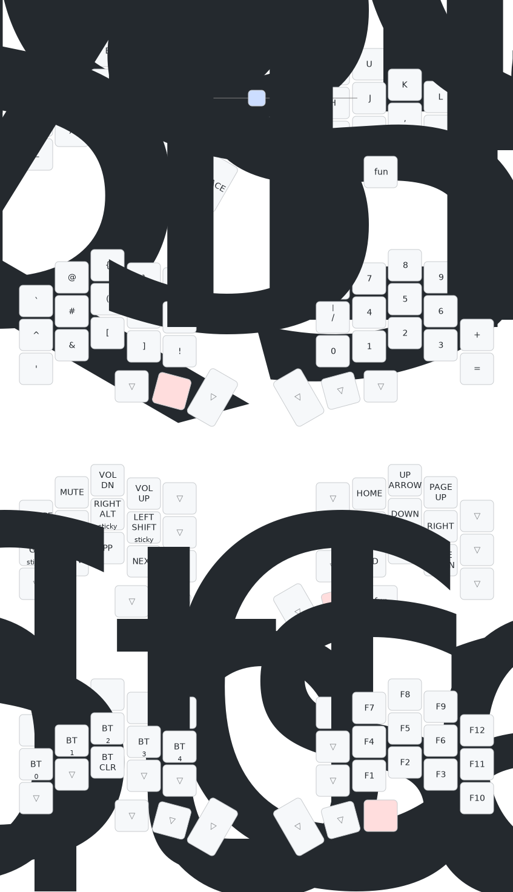

# Chocofi Temper ZMK Config

ZMK config for the [Chocofi Temper](https://github.com/raeedcho/chocofi-temper). 
In addition to the original ZMK features in [raeedcho](https://github.com/raeedcho/temper-zmk-config), [Nabizzle](https://github.com/Nabizzle/temper-zmk-config-view) and [Englmaxi](https://github.com/englmaxi/zmk-dongle-display) repos, I have added and tested the following:

* Nice view compatibility
* Custom Nice View Adapter, just in case you need to configure a bodge wire for the fifth pin
* Nickcoutsos' [Keymap Editor](https://nickcoutsos.github.io/keymap-editor/) compatibility with custom keymap layout 
* Dongle & Dongleless configuration generation. For more information about Dongle configuration, check [SliceMK Dongle doc](https://docs.slicemk.com/firmware/zmk/wireless/dongle/)
* Seeed Studio XIAO nRF52840 compatibility as a dongle
* Different display options (128x32 and 128x64)

# Current Keymap

